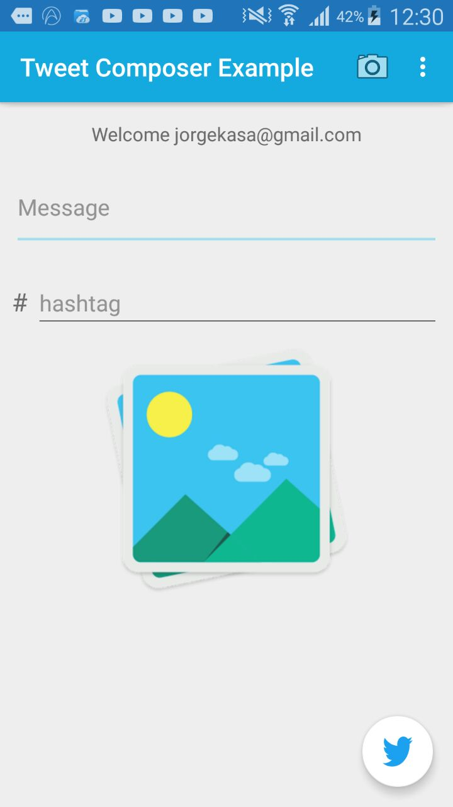
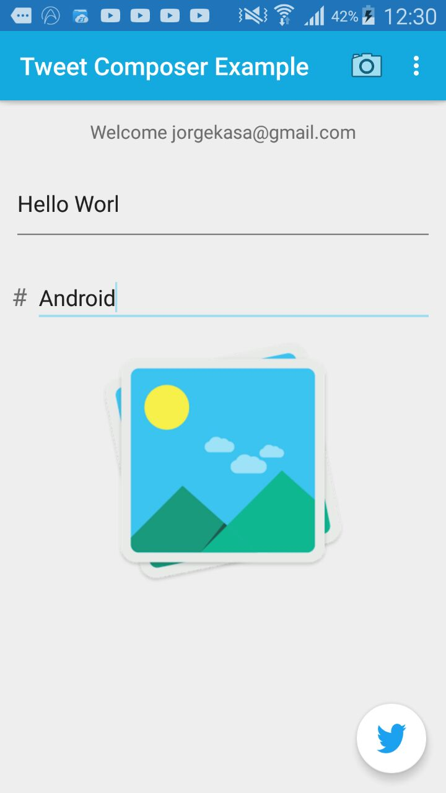
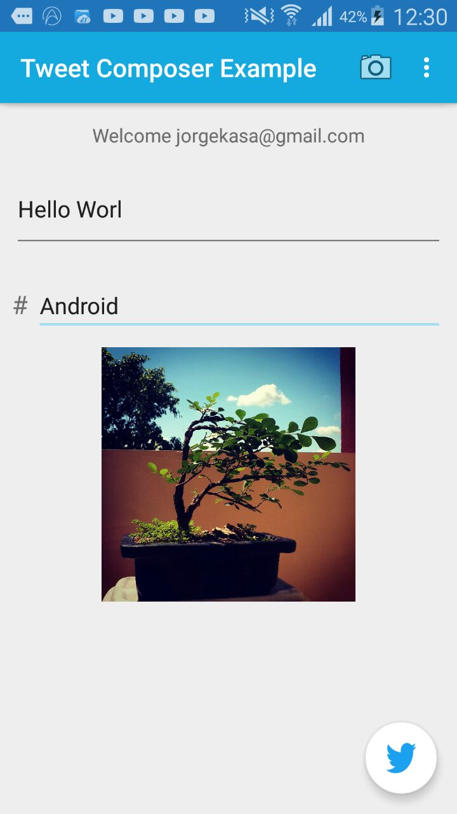
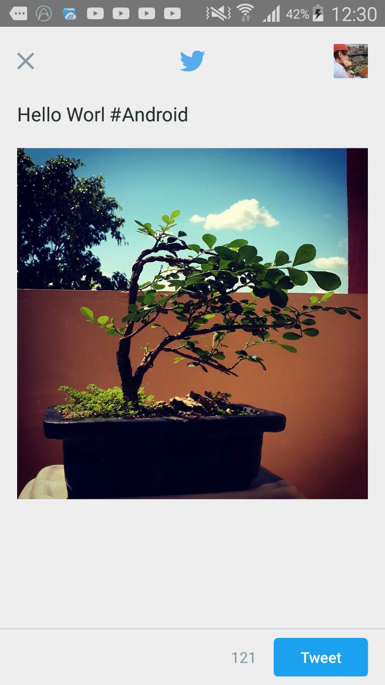
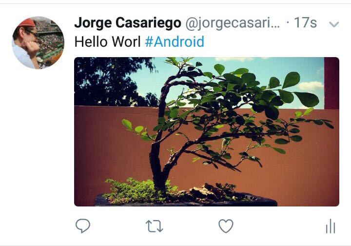

# Twitter Composer with Kotlin

*Project*

Twitter Composer is an example about how to use Twitter Kit for Android.
 
Twitter Kit is a multi-module gradle project containing several Twitter SDKs including TweetComposer, TwitterCore, and TweetUi. Twitter Kit is designed to make interacting with Twitter seamless and efficient.

This project show how to do Log In with Twitter and then how to use Twitter Kit Native Composer, which lets users compose Tweets from within our application.The great thing about this is that does not depend on the Twitter for Android app being installed.
to create tactile, bold, understandable UIs.

**[Twitter Developer Documentation](https://dev.twitter.com/twitterkit/android/overview)**

### Screenshots

### Login

### Tweet

### Result on Twitter

## ToDo:

* Camera option not working in all Android versions 
* Adjust image orientation after taking a picture
* ...

